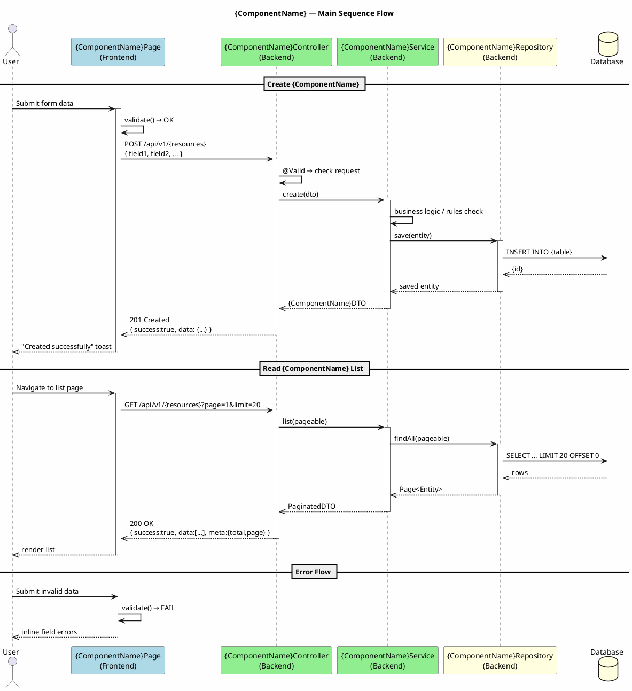
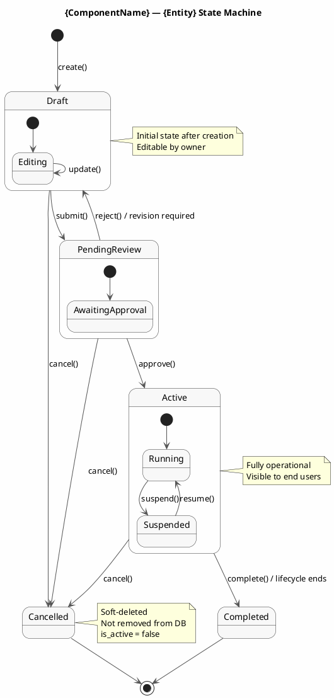

# Component Design Skill v1.0.0

## Purpose
Guide `component-agent` in designing ONE complete component with all 5 artifacts, following the AgentCode Framework convention exactly.

---

## Input Parameters

| Parameter | Required | Description |
|-----------|----------|-------------|
| `component_name` | ✅ | Component name (e.g., AuthModule, ProductModule) |
| `project_name` | ✅ | Project name |
| `use_cases` | ✅ | List of UC IDs handled by this component |
| `entities` | ✅ | List of related data entities |
| `dependencies` | ⚠️ | Other components that this component depends on |

---

## Output Structure (MANDATORY — 5 files)

```
docs/{ProjectName}/
├── diagrams/
│   └── components/
│       └── {component-name}/
│           ├── {component}-class-backend.puml   (1)
│           ├── {component}-class-frontend.puml  (2)
│           ├── {component}-sequence.puml        (3)
│           └── {component}-state.puml           (4)
└── db/
    └── tables/
        └── {component}_tables.sql               (5)
```

**Naming Convention:**
- `component-name` in the folder: kebab-case (e.g., `auth-module`, `product-module`)
- `component` in the file name: kebab-case prefix (e.g., `auth-module-class-backend.puml`)
- `component` in SQL: snake_case prefix (e.g., `auth_module_tables.sql`)

---

## Artifact 1: Class Diagram — Backend

**Purpose:** Describe the backend-side class structure (Controller, Service, Repository, Entity)

**Template:**
```plantuml
@startuml {component}-class-backend
skinparam classAttributeIconSize 0
skinparam packageStyle rectangle
skinparam backgroundColor #FEFEFE
skinparam classBorderColor #333333
skinparam classBackgroundColor #F8F8F8

title {ComponentName} — Backend Class Diagram

package "{component}.controller" {
  class {ComponentName}Controller {
    - {componentName}Service: {ComponentName}Service
    + create(request: CreateRequest): ResponseEntity
    + findById(id: Long): ResponseEntity
    + update(id: Long, request: UpdateRequest): ResponseEntity
    + delete(id: Long): ResponseEntity
    + list(pageable: Pageable): ResponseEntity
  }
}

package "{component}.service" {
  interface I{ComponentName}Service {
    + create(dto: {ComponentName}DTO): {ComponentName}DTO
    + findById(id: Long): {ComponentName}DTO
    + update(id: Long, dto: {ComponentName}DTO): {ComponentName}DTO
    + delete(id: Long): void
    + list(pageable: Pageable): Page<{ComponentName}DTO>
  }

  class {ComponentName}ServiceImpl implements I{ComponentName}Service {
    - repository: {ComponentName}Repository
    - mapper: {ComponentName}Mapper
    + create(dto: {ComponentName}DTO): {ComponentName}DTO
    + findById(id: Long): {ComponentName}DTO
    + update(id: Long, dto: {ComponentName}DTO): {ComponentName}DTO
    + delete(id: Long): void
    + list(pageable: Pageable): Page<{ComponentName}DTO>
  }
}

package "{component}.repository" {
  interface {ComponentName}Repository {
    + findByField(value: Type): Optional<{Entity}>
    + findAllByStatus(status: Status): List<{Entity}>
  }
}

package "{component}.entity" {
  class {Entity} {
    - id: Long
    - {field1}: {Type}
    - {field2}: {Type}
    - createdAt: LocalDateTime
    - updatedAt: LocalDateTime
  }
}

package "{component}.dto" {
  class {ComponentName}DTO {
    + id: Long
    + {field1}: {Type}
    + {field2}: {Type}
  }

  class Create{ComponentName}Request {
    + {requiredField}: {Type}
  }

  class Update{ComponentName}Request {
    + {updatableField}: {Type}
  }
}

{ComponentName}Controller --> I{ComponentName}Service
{ComponentName}ServiceImpl ..|> I{ComponentName}Service
{ComponentName}ServiceImpl --> {ComponentName}Repository
{ComponentName}Repository --> {Entity}
{ComponentName}ServiceImpl --> {ComponentName}DTO
@enduml
```

---

## Artifact 2: Class Diagram — Frontend

**Purpose:** Describe the frontend-side component structure (Page, Component, Hook, Service)

**Template:**
```plantuml
@startuml {component}-class-frontend
skinparam classAttributeIconSize 0
skinparam packageStyle rectangle
skinparam backgroundColor #FEFEFE

title {ComponentName} — Frontend Class Diagram

package "{component}/pages" {
  class {ComponentName}Page {
    - useData: {ComponentName}Hook
    + render(): JSX
    + handleCreate(): void
    + handleEdit(id): void
    + handleDelete(id): void
  }
}

package "{component}/components" {
  class {ComponentName}List {
    + items: {ComponentName}[]
    + onEdit: Function
    + onDelete: Function
    + render(): JSX
  }

  class {ComponentName}Form {
    + initialData?: {ComponentName}
    + onSubmit: Function
    + onCancel: Function
    - formState: FormState
    + render(): JSX
    + validate(): boolean
  }

  class {ComponentName}Detail {
    + data: {ComponentName}
    + render(): JSX
  }
}

package "{component}/hooks" {
  class use{ComponentName}List {
    + data: {ComponentName}[]
    + isLoading: boolean
    + error: Error | null
    + pagination: PaginationState
    + refetch(): void
    + handlePageChange(page): void
  }

  class use{ComponentName}Form {
    + handleSubmit(data): Promise<void>
    + isSubmitting: boolean
    + error: string | null
  }
}

package "{component}/services" {
  class {ComponentName}ApiService {
    - httpClient: HttpClient
    + getAll(params): Promise<PaginatedResponse>
    + getById(id): Promise<{ComponentName}>
    + create(data): Promise<{ComponentName}>
    + update(id, data): Promise<{ComponentName}>
    + delete(id): Promise<void>
  }
}

package "{component}/types" {
  class {ComponentName} {
    + id: number
    + {field1}: {Type}
    + {field2}: {Type}
    + createdAt: string
  }

  class Create{ComponentName}Input {
    + {requiredField}: {Type}
  }
}

{ComponentName}Page --> use{ComponentName}List
{ComponentName}Page --> use{ComponentName}Form
{ComponentName}Page --> {ComponentName}List
{ComponentName}Page --> {ComponentName}Form
{ComponentName}Page --> {ComponentName}Detail
use{ComponentName}List --> {ComponentName}ApiService
use{ComponentName}Form --> {ComponentName}ApiService
{ComponentName}ApiService --> {ComponentName}
@enduml
```

---

## Artifact 3: Sequence Diagram

**Purpose:** Describe the end-to-end interaction flow from User → Frontend → Backend → DB for the main operation

**Template:**


---

## Artifact 4: State Diagram

**Purpose:** Describe the lifecycle of the component's main entity

**Template:**


> **Customization guide:** Adjust the states to match the specific component's business logic. Examples:
> - OrderModule: `Pending → Confirmed → Processing → Shipped → Delivered → Completed / Cancelled`
> - AuthModule: `Unverified → Active → Suspended → Deactivated`
> - PaymentModule: `Initiated → Processing → Completed → Refunded / Failed`

---

## Artifact 5: Database Tables SQL

**Purpose:** DDL for all tables belonging to this component

**Template:**
```sql
-- =============================================
-- Component: {ComponentName}
-- Project: {ProjectName}
-- Generated by: AgentCode Framework v1.0.0
-- =============================================

-- Table: {table_name} (main entity)
CREATE TABLE {table_name} (
    id          BIGINT          PRIMARY KEY AUTO_INCREMENT,
    -- === Business Columns ===
    {col1}      VARCHAR(255)    NOT NULL,
    {col2}      TEXT            NULL,
    status      ENUM('{S1}','{S2}','{S3}')  NOT NULL DEFAULT '{S1}',
    is_active   BOOLEAN         NOT NULL DEFAULT TRUE,
    -- === FK Columns ===
    {parent_id} BIGINT          NOT NULL,
    -- === Audit Columns ===
    created_by  BIGINT          NULL,
    created_at  TIMESTAMP       NOT NULL DEFAULT CURRENT_TIMESTAMP,
    updated_at  TIMESTAMP       NOT NULL DEFAULT CURRENT_TIMESTAMP ON UPDATE CURRENT_TIMESTAMP,
    deleted_at  TIMESTAMP       NULL DEFAULT NULL,

    CONSTRAINT fk_{table}_{parent} FOREIGN KEY ({parent_id}) REFERENCES {parent_table}(id)
        ON DELETE RESTRICT ON UPDATE CASCADE
);

-- Indexes for {table_name}
CREATE INDEX idx_{table_name}_status      ON {table_name}(status);
CREATE INDEX idx_{table_name}_{parent_id} ON {table_name}({parent_id});
CREATE INDEX idx_{table_name}_created_at  ON {table_name}(created_at);

-- Table: {related_table} (if component has multiple tables)
CREATE TABLE {related_table} (
    id          BIGINT          PRIMARY KEY AUTO_INCREMENT,
    {table_id}  BIGINT          NOT NULL,
    {col1}      {TYPE}          NOT NULL,
    created_at  TIMESTAMP       NOT NULL DEFAULT CURRENT_TIMESTAMP,

    CONSTRAINT fk_{related_table}_{table} FOREIGN KEY ({table_id}) REFERENCES {table_name}(id)
        ON DELETE CASCADE
);

CREATE INDEX idx_{related_table}_{table_id} ON {related_table}({table_id});
```

---

## Quality Checklist — after finishing the component

Before reporting completion to sdd-agent, verify:

```
✅ {component}-class-backend.puml  — exists, contains @startuml/@enduml
✅ {component}-class-frontend.puml — exists, contains @startuml/@enduml
✅ {component}-sequence.puml       — exists, contains @startuml/@enduml
✅ {component}-state.puml          — exists, contains @startuml/@enduml
✅ db/tables/{component}_tables.sql — exists, contains at least 1 CREATE TABLE

✅ Class diagrams include: Controller, Service, Repository, Entity (backend)
✅ Class diagrams include: Page, Component, Hook, Service (frontend)
✅ Sequence diagram covers at least: Create + Read + Error flows
✅ State diagram covers the full lifecycle with [*] start and end states
✅ SQL includes: PRIMARY KEY, timestamps, indexes, foreign key constraints
```

---

## Naming Reference

| Pattern | Example |
|---------|---------|
| Component folder | `diagrams/components/auth-module/` |
| Backend diagram | `auth-module-class-backend.puml` |
| Frontend diagram | `auth-module-class-frontend.puml` |
| Sequence diagram | `auth-module-sequence.puml` |
| State diagram | `auth-module-state.puml` |
| DB tables | `db/tables/auth_module_tables.sql` |
| PlantUML title | `AuthModule — Backend Class Diagram` |
| Main entity | `User` (not `AuthModuleUser`) |
| Main table | `users` (not `auth_module_users`) |
