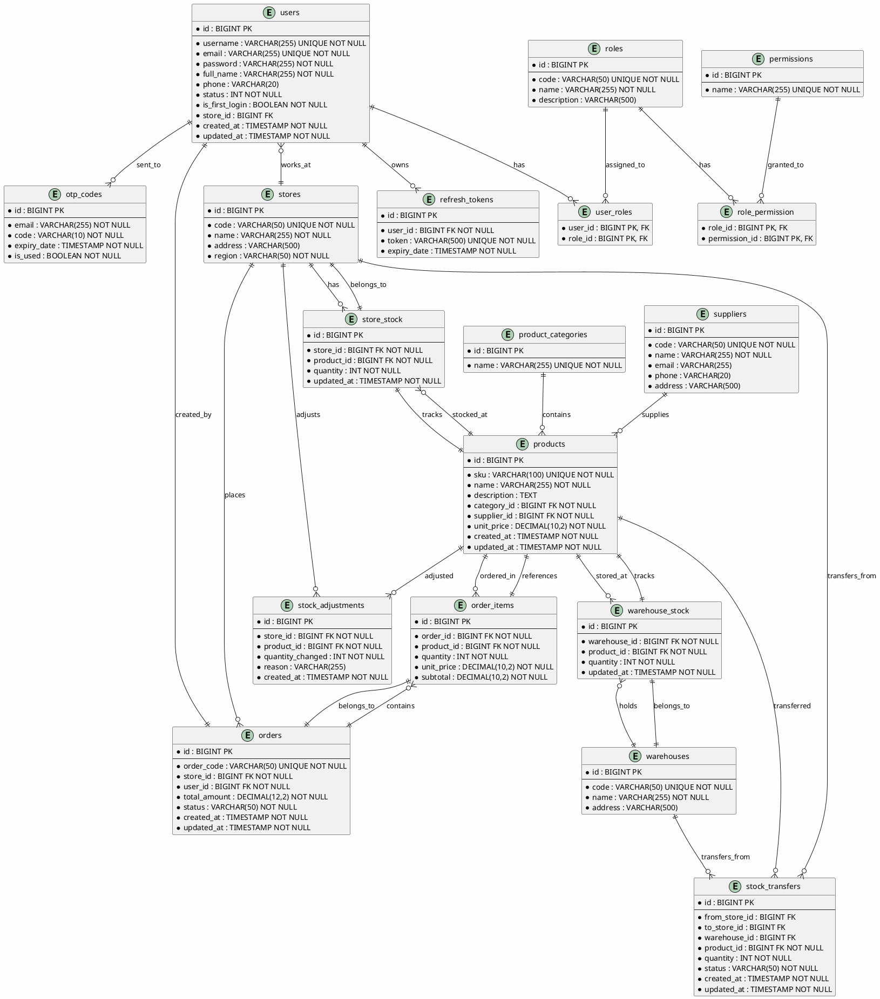

# Database Design Skill

## Purpose
Design a complete database schema including ER diagram and DDL statements.

## Design Process

### Step 1: Analyze Data Requirements
- Identify entities (entity objects)
- Identify attributes (properties)
- Identify relationships (associations)

### Step 2: Design Conceptual Schema (ER Diagram)

**ER Notation**:
```
Entity (Rectangle)
    │
    ├─ Attributes (Ellipse)
    │    └── Primary Key (Underline)
    │
    └─ Relationships (Diamond)
         │
         └─ Cardinality (1:1, 1:N, M:N)
```

**ER Example**:
```
    ┌─────────────┐         ┌─────────────┐
    │   Customer  │         │    Order    │
    ├─────────────┤         ├─────────────┤
    │ PK customer_id│◀─────│ FK customer_id│
    │   name      │   1:N  │ PK order_id   │
    │   email     │         │   order_date  │
    │   phone     │         │   status      │
    └─────────────┘         └─────────────┘
```

### Step 3: Design Logical Schema

**Normalization**:
- 1NF: Atomic values
- 2NF: No partial dependencies
- 3NF: No transitive dependencies
- BCNF: Boyce-Codd Normal Form

### Step 4: Design Physical Schema

**Table Definitions (SQL)**:

```sql
-- Customers table
CREATE TABLE customers (
    customer_id UUID PRIMARY KEY DEFAULT gen_random_uuid(),
    name VARCHAR(100) NOT NULL,
    email VARCHAR(255) UNIQUE NOT NULL,
    phone VARCHAR(20),
    created_at TIMESTAMP DEFAULT CURRENT_TIMESTAMP,
    updated_at TIMESTAMP DEFAULT CURRENT_TIMESTAMP
);

-- Orders table
CREATE TABLE orders (
    order_id UUID PRIMARY KEY DEFAULT gen_random_uuid(),
    customer_id UUID NOT NULL REFERENCES customers(customer_id),
    order_date TIMESTAMP NOT NULL DEFAULT CURRENT_TIMESTAMP,
    status VARCHAR(50) NOT NULL DEFAULT 'pending',
    total_amount DECIMAL(10, 2) NOT NULL DEFAULT 0,
    created_at TIMESTAMP DEFAULT CURRENT_TIMESTAMP,
    updated_at TIMESTAMP DEFAULT CURRENT_TIMESTAMP
);

-- Order Items table (for M:N relationship)
CREATE TABLE order_items (
    order_item_id UUID PRIMARY KEY DEFAULT gen_random_uuid(),
    order_id UUID NOT NULL REFERENCES orders(order_id),
    product_id UUID NOT NULL REFERENCES products(product_id),
    quantity INTEGER NOT NULL DEFAULT 1,
    unit_price DECIMAL(10, 2) NOT NULL,
    subtotal DECIMAL(10, 2) NOT NULL,
    created_at TIMESTAMP DEFAULT CURRENT_TIMESTAMP
);
```

### Step 5: Create Indexes

```sql
-- Indexes for performance
CREATE INDEX idx_orders_customer ON orders(customer_id);
CREATE INDEX idx_orders_date ON orders(order_date);
CREATE INDEX idx_order_items_order ON order_items(order_id);
CREATE INDEX idx_order_items_product ON order_items(product_id);
```

## Output Format for SDD

### 5. Database Design

### 5.1 Database Design

#### ER Diagram (PlantUML)



#### Table Definitions

#### ***1\. users***

| \# | Field name | Type | Size | Unique | Not Null | PK/FK | Notes |
| :---: | ----- | ----- | ----- | ----- | ----- | ----- | ----- |
| 1 | id | BIGINT | | Yes | Yes | PK | Primary identifier |
| 2 | username | VARCHAR | 255 | Yes | Yes | | Login identifier |
| 3 | email | VARCHAR | 255 | Yes | Yes | | User email |
| 4 | password | VARCHAR | 255 | No | Yes | | BCrypt hashed password |
| 5 | full_name | VARCHAR | 255 | No | Yes | | User's full name |
| 6 | phone | VARCHAR | 20 | No | No | | Contact number |
| 7 | status | INT | | No | Yes | | 1: Active, 0: Blocked |
| 8 | is_first_login | BOOLEAN | | No | Yes | | Force password change flag |
| 9 | store_id | BIGINT | | No | No | FK | Links to stores table |
| 10 | created_at | TIMESTAMP | | No | Yes | | Audit record creation |
| 11 | updated_at | TIMESTAMP | | No | Yes | | Audit record update |

#### ***2\. roles***

| \# | Field name | Type | Size | Unique | Not Null | PK/FK | Notes |
| :---: | ----- | ----- | ----- | ----- | ----- | ----- | ----- |
| 1 | id | BIGINT | | Yes | Yes | PK | Primary identifier |
| 2 | code | VARCHAR | 50 | Yes | Yes | | Role code (e.g., SUPER_ADMIN) |
| 3 | name | VARCHAR | 255 | No | Yes | | Display name |
| 4 | description | VARCHAR | 500 | No | No | | Role purpose |

#### ***3\. permissions***

| \# | Field name | Type | Size | Unique | Not Null | PK/FK | Notes |
| :---: | ----- | ----- | ----- | ----- | ----- | ----- | ----- |
| 1 | id | BIGINT | | Yes | Yes | PK | Primary identifier |
| 2 | name | VARCHAR | 255 | Yes | Yes | | Permission name/code |

#### ***4\. user_roles***

| \# | Field name | Type | Size | Unique | Not Null | PK/FK | Notes |
| :---: | ----- | ----- | ----- | ----- | ----- | ----- | ----- |
| 1 | user_id | BIGINT | | No | Yes | PK, FK | Reference to users |
| 2 | role_id | BIGINT | | No | Yes | PK, FK | Reference to roles |

#### ***5\. role_permission***

| \# | Field name | Type | Size | Unique | Not Null | PK/FK | Notes |
| :---: | ----- | ----- | ----- | ----- | ----- | ----- | ----- |
| 1 | role_id | BIGINT | | No | Yes | PK, FK | Reference to roles |
| 2 | permission_id | BIGINT | | No | Yes | PK, FK | Reference to permissions |

#### ***6\. refresh_tokens***

| \# | Field name | Type | Size | Unique | Not Null | PK/FK | Notes |
| :---: | ----- | ----- | ----- | ----- | ----- | ----- | ----- |
| 1 | id | BIGINT | | Yes | Yes | PK | Primary identifier |
| 2 | user_id | BIGINT | | No | Yes | FK | Owner of the token |
| 3 | token | VARCHAR | 500 | Yes | Yes | | Encrypted token string |
| 4 | expiry_date | TIMESTAMP | | No | Yes | | Token expiration time |

#### ***7\. otp_codes***

| \# | Field name | Type | Size | Unique | Not Null | PK/FK | Notes |
| :---: | ----- | ----- | ----- | ----- | ----- | ----- | ----- |
| 1 | id | BIGINT | | Yes | Yes | PK | Primary identifier |
| 2 | email | VARCHAR | 255 | No | Yes | | Target email |
| 3 | code | VARCHAR | 10 | No | Yes | | 6-digit OTP code |
| 4 | expiry_date | TIMESTAMP | | No | Yes | | OTP validity period |
| 5 | is_used | BOOLEAN | | No | Yes | | Status of the code |

#### ***8\. stores***

| \# | Field name | Type | Size | Unique | Not Null | PK/FK | Notes |
| :---: | ----- | ----- | ----- | ----- | ----- | ----- | ----- |
| 1 | id | BIGINT | | Yes | Yes | PK | Primary identifier |
| 2 | code | VARCHAR | 50 | Yes | Yes | | Unique store code |
| 3 | name | VARCHAR | 255 | No | Yes | | Store name |
| 4 | address | VARCHAR | 500 | No | No | | Physical location |
| 5 | region | VARCHAR | 50 | No | Yes | | NORTH, CENTRAL, SOUTH |

#### ***9\. warehouses***

| \# | Field name | Type | Size | Unique | Not Null | PK/FK | Notes |
| :---: | ----- | ----- | ----- | ----- | ----- | ----- | ----- |
| 1 | id | BIGINT | | Yes | Yes | PK | Primary identifier |
| 2 | code | VARCHAR | 50 | Yes | Yes | | Unique warehouse code |
| 3 | name | VARCHAR | 255 | No | Yes | | Warehouse name |
| 4 | address | VARCHAR | 500 | No | No | | Physical location |

#### ***10\. product_categories***

| \# | Field name | Type | Size | Unique | Not Null | PK/FK | Notes |
| :---: | ----- | ----- | ----- | ----- | ----- | ----- | ----- |
| 1 | id | BIGINT | | Yes | Yes | PK | Primary identifier |
| 2 | name | VARCHAR | 255 | Yes | Yes | | Category name |

#### ***11\. suppliers***

| \# | Field name | Type | Size | Unique | Not Null | PK/FK | Notes |
| :---: | ----- | ----- | ----- | ----- | ----- | ----- | ----- |
| 1 | id | BIGINT | | Yes | Yes | PK | Primary identifier |
| 2 | code | VARCHAR | 50 | Yes | Yes | | Unique supplier code |
| 3 | name | VARCHAR | 255 | No | Yes | | Supplier name |
| 4 | email | VARCHAR | 255 | No | No | | Contact email |
| 5 | phone | VARCHAR | 20 | No | No | | Contact phone |
| 6 | address | VARCHAR | 500 | No | No | | Business address |

#### ***12\. products***

| \# | Field name | Type | Size | Unique | Not Null | PK/FK | Notes |
| :---: | ----- | ----- | ----- | ----- | ----- | ----- | ----- |
| 1 | id | BIGINT | | Yes | Yes | PK | Primary identifier |
| 2 | sku | VARCHAR | 100 | Yes | Yes | | Stock keeping unit |
| 3 | name | VARCHAR | 255 | No | Yes | | Product name |
| 4 | description | TEXT | | No | No | | Product details |
| 5 | category_id | BIGINT | | No | Yes | FK | Reference to product_categories |
| 6 | supplier_id | BIGINT | | No | Yes | FK | Reference to suppliers |
| 7 | unit_price | DECIMAL | 10,2 | No | Yes | | Selling price |
| 8 | created_at | TIMESTAMP | | No | Yes | | Audit record creation |
| 9 | updated_at | TIMESTAMP | | No | Yes | | Audit record update |

#### ***13\. store_stock***

| \# | Field name | Type | Size | Unique | Not Null | PK/FK | Notes |
| :---: | ----- | ----- | ----- | ----- | ----- | ----- | ----- |
| 1 | id | BIGINT | | Yes | Yes | PK | Primary identifier |
| 2 | store_id | BIGINT | | No | Yes | FK | Reference to stores |
| 3 | product_id | BIGINT | | No | Yes | FK | Reference to products |
| 4 | quantity | INT | | No | Yes | | Available stock |
| 5 | updated_at | TIMESTAMP | | No | Yes | | Last stock update |

#### ***14\. warehouse_stock***

| \# | Field name | Type | Size | Unique | Not Null | PK/FK | Notes |
| :---: | ----- | ----- | ----- | ----- | ----- | ----- | ----- |
| 1 | id | BIGINT | | Yes | Yes | PK | Primary identifier |
| 2 | warehouse_id | BIGINT | | No | Yes | FK | Reference to warehouses |
| 3 | product_id | BIGINT | | No | Yes | FK | Reference to products |
| 4 | quantity | INT | | No | Yes | | Available stock |
| 5 | updated_at | TIMESTAMP | | No | Yes | | Last stock update |

#### ***15\. orders***

| \# | Field name | Type | Size | Unique | Not Null | PK/FK | Notes |
| :---: | ----- | ----- | ----- | ----- | ----- | ----- | ----- |
| 1 | id | BIGINT | | Yes | Yes | PK | Primary identifier |
| 2 | order_code | VARCHAR | 50 | Yes | Yes | | Unique order code |
| 3 | store_id | BIGINT | | No | Yes | FK | Reference to stores |
| 4 | user_id | BIGINT | | No | Yes | FK | Reference to users |
| 5 | total_amount | DECIMAL | 12,2 | No | Yes | | Order total |
| 6 | status | VARCHAR | 50 | No | Yes | | Order status |
| 7 | created_at | TIMESTAMP | | No | Yes | | Order creation time |
| 8 | updated_at | TIMESTAMP | | No | Yes | | Last update time |

#### ***16\. order_items***

| \# | Field name | Type | Size | Unique | Not Null | PK/FK | Notes |
| :---: | ----- | ----- | ----- | ----- | ----- | ----- | ----- |
| 1 | id | BIGINT | | Yes | Yes | PK | Primary identifier |
| 2 | order_id | BIGINT | | No | Yes | FK | Reference to orders |
| 3 | product_id | BIGINT | | No | Yes | FK | Reference to products |
| 4 | quantity | INT | | No | Yes | | Item quantity |
| 5 | unit_price | DECIMAL | 10,2 | No | Yes | | Price at purchase time |
| 6 | subtotal | DECIMAL | 10,2 | No | Yes | | Line item total |

#### ***17\. stock_transfers***

| \# | Field name | Type | Size | Unique | Not Null | PK/FK | Notes |
| :---: | ----- | ----- | ----- | ----- | ----- | ----- | ----- |
| 1 | id | BIGINT | | Yes | Yes | PK | Primary identifier |
| 2 | from_store_id | BIGINT | | No | No | FK | Source store |
| 3 | to_store_id | BIGINT | | No | No | FK | Destination store |
| 4 | warehouse_id | BIGINT | | No | No | FK | Source warehouse |
| 5 | product_id | BIGINT | | No | Yes | FK | Reference to products |
| 6 | quantity | INT | | No | Yes | | Transfer quantity |
| 7 | status | VARCHAR | 50 | No | Yes | | Transfer status |
| 8 | created_at | TIMESTAMP | | No | Yes | | Transfer creation time |
| 9 | updated_at | TIMESTAMP | | No | Yes | | Last update time |

#### ***18\. stock_adjustments***

| \# | Field name | Type | Size | Unique | Not Null | PK/FK | Notes |
| :---: | ----- | ----- | ----- | ----- | ----- | ----- | ----- |
| 1 | id | BIGINT | | Yes | Yes | PK | Primary identifier |
| 2 | store_id | BIGINT | | No | Yes | FK | Reference to stores |
| 3 | product_id | BIGINT | | No | Yes | FK | Reference to products |
| 4 | quantity_changed | INT | | No | Yes | | Adjustment amount |
| 5 | reason | VARCHAR | 255 | No | No | | Adjustment reason |
| 6 | created_at | TIMESTAMP | | No | Yes | | Adjustment time |

### 5.2 Physical Schema (MySQL DDL)

```sql
-- =====================================================
-- Database Schema for Retail Chain Management System
-- MySQL 8.0
-- =====================================================

-- Users table
CREATE TABLE users (
    id BIGINT AUTO_INCREMENT PRIMARY KEY,
    username VARCHAR(255) NOT NULL UNIQUE,
    email VARCHAR(255) NOT NULL UNIQUE,
    password VARCHAR(255) NOT NULL,
    full_name VARCHAR(255) NOT NULL,
    phone VARCHAR(20),
    status INT NOT NULL DEFAULT 1,
    is_first_login BOOLEAN NOT NULL DEFAULT TRUE,
    store_id BIGINT,
    created_at TIMESTAMP NOT NULL DEFAULT CURRENT_TIMESTAMP,
    updated_at TIMESTAMP NOT NULL DEFAULT CURRENT_TIMESTAMP ON UPDATE CURRENT_TIMESTAMP,
    CONSTRAINT fk_users_store FOREIGN KEY (store_id) REFERENCES stores(id)
) ENGINE=InnoDB DEFAULT CHARSET=utf8mb4 COLLATE=utf8mb4_unicode_ci;

-- Roles table
CREATE TABLE roles (
    id BIGINT AUTO_INCREMENT PRIMARY KEY,
    code VARCHAR(50) NOT NULL UNIQUE,
    name VARCHAR(255) NOT NULL,
    description VARCHAR(500)
) ENGINE=InnoDB DEFAULT CHARSET=utf8mb4 COLLATE=utf8mb4_unicode_ci;

-- Permissions table
CREATE TABLE permissions (
    id BIGINT AUTO_INCREMENT PRIMARY KEY,
    name VARCHAR(255) NOT NULL UNIQUE
) ENGINE=InnoDB DEFAULT CHARSET=utf8mb4 COLLATE=utf8mb4_unicode_ci;

-- User-Role mapping (M:N)
CREATE TABLE user_roles (
    user_id BIGINT NOT NULL,
    role_id BIGINT NOT NULL,
    PRIMARY KEY (user_id, role_id),
    CONSTRAINT fk_user_roles_user FOREIGN KEY (user_id) REFERENCES users(id) ON DELETE CASCADE,
    CONSTRAINT fk_user_roles_role FOREIGN KEY (role_id) REFERENCES roles(id) ON DELETE CASCADE
) ENGINE=InnoDB DEFAULT CHARSET=utf8mb4 COLLATE=utf8mb4_unicode_ci;

-- Role-Permission mapping (M:N)
CREATE TABLE role_permission (
    role_id BIGINT NOT NULL,
    permission_id BIGINT NOT NULL,
    PRIMARY KEY (role_id, permission_id),
    CONSTRAINT fk_role_permission_role FOREIGN KEY (role_id) REFERENCES roles(id) ON DELETE CASCADE,
    CONSTRAINT fk_role_permission_permission FOREIGN KEY (permission_id) REFERENCES permissions(id) ON DELETE CASCADE
) ENGINE=InnoDB DEFAULT CHARSET=utf8mb4 COLLATE=utf8mb4_unicode_ci;

-- Refresh tokens table
CREATE TABLE refresh_tokens (
    id BIGINT AUTO_INCREMENT PRIMARY KEY,
    user_id BIGINT NOT NULL,
    token VARCHAR(500) NOT NULL UNIQUE,
    expiry_date TIMESTAMP NOT NULL,
    CONSTRAINT fk_refresh_tokens_user FOREIGN KEY (user_id) REFERENCES users(id) ON DELETE CASCADE
) ENGINE=InnoDB DEFAULT CHARSET=utf8mb4 COLLATE=utf8mb4_unicode_ci;

-- OTP codes table
CREATE TABLE otp_codes (
    id BIGINT AUTO_INCREMENT PRIMARY KEY,
    email VARCHAR(255) NOT NULL,
    code VARCHAR(10) NOT NULL,
    expiry_date TIMESTAMP NOT NULL,
    is_used BOOLEAN NOT NULL DEFAULT FALSE,
    INDEX idx_otp_email (email),
    INDEX idx_otp_code_expiry (code, expiry_date)
) ENGINE=InnoDB DEFAULT CHARSET=utf8mb4 COLLATE=utf8mb4_unicode_ci;

-- Stores table
CREATE TABLE stores (
    id BIGINT AUTO_INCREMENT PRIMARY KEY,
    code VARCHAR(50) NOT NULL UNIQUE,
    name VARCHAR(255) NOT NULL,
    address VARCHAR(500),
    region VARCHAR(50) NOT NULL
) ENGINE=InnoDB DEFAULT CHARSET=utf8mb4 COLLATE=utf8mb4_unicode_ci;

-- Warehouses table
CREATE TABLE warehouses (
    id BIGINT AUTO_INCREMENT PRIMARY KEY,
    code VARCHAR(50) NOT NULL UNIQUE,
    name VARCHAR(255) NOT NULL,
    address VARCHAR(500)
) ENGINE=InnoDB DEFAULT CHARSET=utf8mb4 COLLATE=utf8mb4_unicode_ci;

-- Product categories table
CREATE TABLE product_categories (
    id BIGINT AUTO_INCREMENT PRIMARY KEY,
    name VARCHAR(255) NOT NULL UNIQUE
) ENGINE=InnoDB DEFAULT CHARSET=utf8mb4 COLLATE=utf8mb4_unicode_ci;

-- Suppliers table
CREATE TABLE suppliers (
    id BIGINT AUTO_INCREMENT PRIMARY KEY,
    code VARCHAR(50) NOT NULL UNIQUE,
    name VARCHAR(255) NOT NULL,
    email VARCHAR(255),
    phone VARCHAR(20),
    address VARCHAR(500)
) ENGINE=InnoDB DEFAULT CHARSET=utf8mb4 COLLATE=utf8mb4_unicode_ci;

-- Products table
CREATE TABLE products (
    id BIGINT AUTO_INCREMENT PRIMARY KEY,
    sku VARCHAR(100) NOT NULL UNIQUE,
    name VARCHAR(255) NOT NULL,
    description TEXT,
    category_id BIGINT NOT NULL,
    supplier_id BIGINT NOT NULL,
    unit_price DECIMAL(10,2) NOT NULL,
    created_at TIMESTAMP NOT NULL DEFAULT CURRENT_TIMESTAMP,
    updated_at TIMESTAMP NOT NULL DEFAULT CURRENT_TIMESTAMP ON UPDATE CURRENT_TIMESTAMP,
    CONSTRAINT fk_products_category FOREIGN KEY (category_id) REFERENCES product_categories(id),
    CONSTRAINT fk_products_supplier FOREIGN KEY (supplier_id) REFERENCES suppliers(id)
) ENGINE=InnoDB DEFAULT CHARSET=utf8mb4 COLLATE=utf8mb4_unicode_ci;

-- Store stock table
CREATE TABLE store_stock (
    id BIGINT AUTO_INCREMENT PRIMARY KEY,
    store_id BIGINT NOT NULL,
    product_id BIGINT NOT NULL,
    quantity INT NOT NULL DEFAULT 0,
    updated_at TIMESTAMP NOT NULL DEFAULT CURRENT_TIMESTAMP ON UPDATE CURRENT_TIMESTAMP,
    UNIQUE KEY uk_store_product (store_id, product_id),
    CONSTRAINT fk_store_stock_store FOREIGN KEY (store_id) REFERENCES stores(id) ON DELETE CASCADE,
    CONSTRAINT fk_store_stock_product FOREIGN KEY (product_id) REFERENCES products(id) ON DELETE CASCADE
) ENGINE=InnoDB DEFAULT CHARSET=utf8mb4 COLLATE=utf8mb4_unicode_ci;

-- Warehouse stock table
CREATE TABLE warehouse_stock (
    id BIGINT AUTO_INCREMENT PRIMARY KEY,
    warehouse_id BIGINT NOT NULL,
    product_id BIGINT NOT NULL,
    quantity INT NOT NULL DEFAULT 0,
    updated_at TIMESTAMP NOT NULL DEFAULT CURRENT_TIMESTAMP ON UPDATE CURRENT_TIMESTAMP,
    UNIQUE KEY uk_warehouse_product (warehouse_id, product_id),
    CONSTRAINT fk_warehouse_stock_warehouse FOREIGN KEY (warehouse_id) REFERENCES warehouses(id) ON DELETE CASCADE,
    CONSTRAINT fk_warehouse_stock_product FOREIGN KEY (product_id) REFERENCES products(id) ON DELETE CASCADE
) ENGINE=InnoDB DEFAULT CHARSET=utf8mb4 COLLATE=utf8mb4_unicode_ci;

-- Orders table
CREATE TABLE orders (
    id BIGINT AUTO_INCREMENT PRIMARY KEY,
    order_code VARCHAR(50) NOT NULL UNIQUE,
    store_id BIGINT NOT NULL,
    user_id BIGINT NOT NULL,
    total_amount DECIMAL(12,2) NOT NULL DEFAULT 0,
    status VARCHAR(50) NOT NULL,
    created_at TIMESTAMP NOT NULL DEFAULT CURRENT_TIMESTAMP,
    updated_at TIMESTAMP NOT NULL DEFAULT CURRENT_TIMESTAMP ON UPDATE CURRENT_TIMESTAMP,
    CONSTRAINT fk_orders_store FOREIGN KEY (store_id) REFERENCES stores(id),
    CONSTRAINT fk_orders_user FOREIGN KEY (user_id) REFERENCES users(id)
) ENGINE=InnoDB DEFAULT CHARSET=utf8mb4 COLLATE=utf8mb4_unicode_ci;

-- Order items table
CREATE TABLE order_items (
    id BIGINT AUTO_INCREMENT PRIMARY KEY,
    order_id BIGINT NOT NULL,
    product_id BIGINT NOT NULL,
    quantity INT NOT NULL,
    unit_price DECIMAL(10,2) NOT NULL,
    subtotal DECIMAL(10,2) NOT NULL,
    CONSTRAINT fk_order_items_order FOREIGN KEY (order_id) REFERENCES orders(id) ON DELETE CASCADE,
    CONSTRAINT fk_order_items_product FOREIGN KEY (product_id) REFERENCES products(id)
) ENGINE=InnoDB DEFAULT CHARSET=utf8mb4 COLLATE=utf8mb4_unicode_ci;

-- Stock transfers table
CREATE TABLE stock_transfers (
    id BIGINT AUTO_INCREMENT PRIMARY KEY,
    from_store_id BIGINT,
    to_store_id BIGINT,
    warehouse_id BIGINT,
    product_id BIGINT NOT NULL,
    quantity INT NOT NULL,
    status VARCHAR(50) NOT NULL,
    created_at TIMESTAMP NOT NULL DEFAULT CURRENT_TIMESTAMP,
    updated_at TIMESTAMP NOT NULL DEFAULT CURRENT_TIMESTAMP ON UPDATE CURRENT_TIMESTAMP,
    CONSTRAINT fk_stock_transfers_from_store FOREIGN KEY (from_store_id) REFERENCES stores(id),
    CONSTRAINT fk_stock_transfers_to_store FOREIGN KEY (to_store_id) REFERENCES stores(id),
    CONSTRAINT fk_stock_transfers_warehouse FOREIGN KEY (warehouse_id) REFERENCES warehouses(id),
    CONSTRAINT fk_stock_transfers_product FOREIGN KEY (product_id) REFERENCES products(id)
) ENGINE=InnoDB DEFAULT CHARSET=utf8mb4 COLLATE=utf8mb4_unicode_ci;

-- Stock adjustments table
CREATE TABLE stock_adjustments (
    id BIGINT AUTO_INCREMENT PRIMARY KEY,
    store_id BIGINT NOT NULL,
    product_id BIGINT NOT NULL,
    quantity_changed INT NOT NULL,
    reason VARCHAR(255),
    created_at TIMESTAMP NOT NULL DEFAULT CURRENT_TIMESTAMP,
    CONSTRAINT fk_stock_adjustments_store FOREIGN KEY (store_id) REFERENCES stores(id),
    CONSTRAINT fk_stock_adjustments_product FOREIGN KEY (product_id) REFERENCES products(id)
) ENGINE=InnoDB DEFAULT CHARSET=utf8mb4 COLLATE=utf8mb4_unicode_ci;

-- =====================================================
-- Indexes for Performance
-- =====================================================

CREATE INDEX idx_users_email ON users(email);
CREATE INDEX idx_users_store ON users(store_id);
CREATE INDEX idx_products_sku ON products(sku);
CREATE INDEX idx_products_category ON products(category_id);
CREATE INDEX idx_store_stock_store ON store_stock(store_id);
CREATE INDEX idx_store_stock_product ON store_stock(product_id);
CREATE INDEX idx_warehouse_stock_warehouse ON warehouse_stock(warehouse_id);
CREATE INDEX idx_orders_store ON orders(store_id);
CREATE INDEX idx_orders_user ON orders(user_id);
CREATE INDEX idx_orders_status ON orders(status);
CREATE INDEX idx_orders_created ON orders(created_at);
CREATE INDEX idx_order_items_order ON order_items(order_id);
CREATE INDEX idx_order_items_product ON order_items(product_id);
CREATE INDEX idx_stock_transfers_product ON stock_transfers(product_id);
CREATE INDEX idx_stock_transfers_status ON stock_transfers(status);
CREATE INDEX idx_stock_adjustments_store ON stock_adjustments(store_id);
CREATE INDEX idx_stock_adjustments_product ON stock_adjustments(product_id);
```

### 5.3 Data File Design

| File | Purpose | Format |
|------|---------|--------|
| schema.sql | Database schema | SQL |
| seed_data.sql | Test data | SQL |
| migrations/ | Version control | SQL |

## Best Practices

1. **Naming Conventions**:
   - Tables: plural, snake_case (customers, order_items)
   - Columns: snake_case (customer_id, order_date)
   - Primary Keys: {table}_id or id
   - Foreign Keys: {referenced_table}_id

2. **Data Types**:
   - UUID for primary keys
   - TIMESTAMP for dates
   - DECIMAL for currency
   - VARCHAR with explicit length

3. **Constraints**:
   - NOT NULL for required fields
   - UNIQUE for business keys
   - CHECK for validation rules

4. **Soft Deletes**:
   - Use `deleted_at` column instead of DELETE
