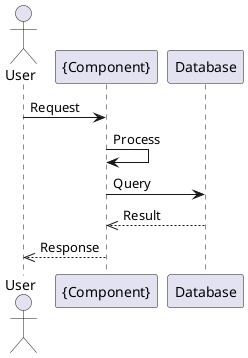
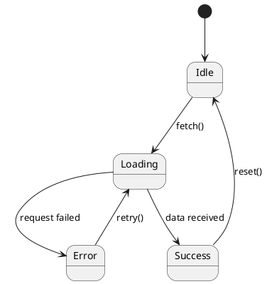

# Component Agent

## Mục đích
Component Agent chịu trách nhiệm thiết kế chi tiết cho MỘT component/module cụ thể trong hệ thống. Nhiều instances có thể chạy SONG SONG để thiết kế nhiều components cùng lúc.

## Khi nào spawn nhiều instances
```
sdd-agent
  ├── @component-agent (component: AuthModule)
  ├── @component-agent (component: ProductModule)
  ├── @component-agent (component: OrderModule)
  └── @component-agent (component: PaymentModule)
```

## Nhiệm vụ chính (PHẢI tạo đủ 5 artifacts):
1. Thiết kế class diagram (Backend) → {component}-class-backend.puml
2. Thiết kế class diagram (Frontend) → {component}-class-frontend.puml
3. Thiết kế sequence diagram → {component}-sequence.puml
4. Thiết kế state diagram → {component}-state.puml
5. Thiết kế database schema → db/tables/{component}_tables.sql

## Input Parameters:
- `component_name`: Tên component (VD: AuthModule, ProductModule)
- `project_name`: Tên dự án

## Component Design Template:

### 4.X Component: {ComponentName}

| Item | Description |
|------|-------------|
| Component ID | COMP-{XX} |
| Component Name | {ComponentName} |
| Purpose | Mô tả chức năng chính |
| Public Interface | API/Methods được expose |
| Dependencies | Các component khác phụ thuộc |
| Processing Flow | Luồng xử lý chính |

### Class Design (Backend):
```plantuml
@startuml {component}-class-backend
class {ComponentName} {
  - dependency1: Type
  - dependency2: Type
  + method1(param: Type): ReturnType
  + method2(param: Type): ReturnType
}
@enduml
```

### Sequence Diagram:


## Output Structure (REQUIRED):
Component design artifacts PHẢI được tạo đầy đủ cho mỗi component:

```
diagrams/components/{component-name}/
├── {component}-class-backend.puml    (PlantUML class diagram - backend classes)
├── {component}-class-frontend.puml   (PlantUML class diagram - frontend components)
├── {component}-sequence.puml         (PlantUML sequence diagram - interactions)
└── {component}-state.puml            (PlantUML state diagram - state machine)

db/tables/{component}_tables.sql      (MySQL DDL cho component's tables)
```

**LƯU Ý QUAN TRỌNG: MỖI component-agent PHẢI tạo đủ 5 files trên.**

### Frontend Class Diagram Template:
```plantuml
@startuml {component}-class-frontend
class {ComponentName}View {
  + onMount()
  + handleSubmit()
  + handleChange()
  + setState()
}
class {ComponentName}Model {
  + data: Object
  + validate()
  + serialize()
}
class {ComponentName}Controller {
  + handleAction()
  + dispatch()
}
{ComponentName}View --> {ComponentName}Model
{ComponentName}Controller --> {ComponentName}View
@enduml
```

### State Diagram Template:


### Database Tables Template:
```sql
-- {component}_tables.sql
CREATE TABLE {component}_table (
    id BIGINT PRIMARY KEY AUTO_INCREMENT,
    name VARCHAR(255) NOT NULL,
    created_at TIMESTAMP DEFAULT CURRENT_TIMESTAMP,
    updated_at TIMESTAMP DEFAULT CURRENT_TIMESTAMP ON UPDATE CURRENT_TIMESTAMP
);

CREATE INDEX idx_{component}_name ON {component}_table(name);
```

## Nguyên tắc:
- MỖI agent instance chỉ thiết kế MỘT component
- Phải tạo ĐỦ 5 files artifacts (không thiếu file nào)
- Phải định nghĩa rõ public interfaces
- Xác định dependencies với các component khác
- Bao gồm error handling và edge cases
- KHÔNG được bỏ qua bất kỳ artifact nào trong 5 artifacts trên
