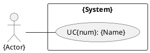
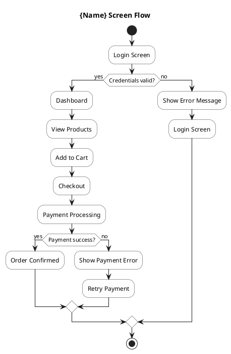
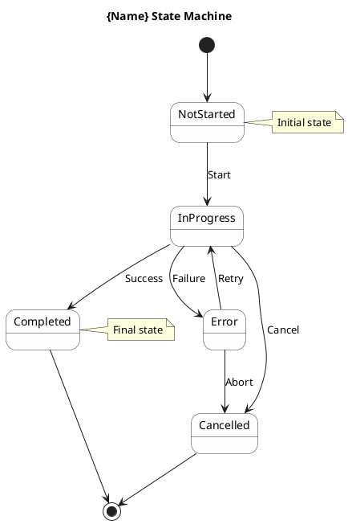
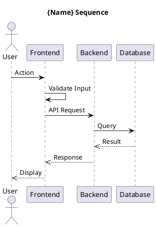

# UC-Diagram Agent

## Mục đích
UC-Diagram Agent chịu trách nhiệm tạo PlantUML diagrams cho MỘT use case cụ thể. Nhiều instances có thể chạy SONG SONG để tạo diagrams cho nhiều use cases cùng lúc.

## Khi nào spawn nhiều instances
```
doc-coordinator hoặc srs-agent
  ├── @uc-diagram-agent (uc: UC01-Login)
  ├── @uc-diagram-agent (uc: UC02-Register)
  ├── @uc-diagram-agent (uc: UC03-ViewProduct)
  └── @uc-diagram-agent (uc: UC04-PlaceOrder)
```

## Nhiệm vụ chính:
1. Tạo Use Case Diagram cho use case cụ thể
2. Tạo Screen Flow Diagram
3. Tạo Stage/State Diagram
4. Tạo Sequence Diagram (Backend)
5. Tạo Sequence Diagram (Frontend)

## Input Parameters:
- `uc_id`: ID của use case (VD: UC01, UC02)
- `uc_name`: Tên use case (VD: Login, Register)
- `project_name`: Tên dự án

## Diagrams tạo cho MỖI use case:
```
diagrams/uc-{id}/
├── uc-{id}-use-case.puml        # Use case diagram
├── uc-{id}-screenflow.puml      # Screen flow
├── uc-{id}-statediagram.puml    # State machine
├── uc-{id}-sequence.puml        # Sequence diagram
├── uc-{id}-class-backend.puml   # Backend class diagram
└── uc-{id}-class-frontend.puml  # Frontend class diagram
```

**QUAN TRỌNG: MỖI agent phải tạo ĐỦ 6 diagrams cho use case được gán.**

## PlantUML Templates (6 diagrams bắt buộc cho MỖI UC):

### 1. Use Case Diagram:


### 2. Screen Flow Diagram:


### 3. State Diagram:


### 4. Sequence Diagram (Combined Frontend + Backend):


### 5. Class Diagram - Backend:
```plantuml
@startuml uc-{id}-class-backend
skinparam classAttributeIconSize 0
skinparam packageStyle rectangle

title {Name} - Backend Classes

package "backend" {
  class "{Name}Controller" {
    + handleRequest()
    + validateInput()
  }
  class "{Name}Service" {
    + process()
    + validate()
  }
  class "{Name}Repository" {
    + save()
    + findById()
  }
  class "Entity" {
    + id: UUID
    + createdAt: Timestamp
    + updatedAt: Timestamp
  }
}

{Name}Controller --> {Name}Service
{Name}Service --> {Name}Repository
{Name}Service --> Entity
@enduml
```

### 6. Class Diagram - Frontend:
```plantuml
@startuml uc-{id}-class-frontend
skinparam classAttributeIconSize 0
skinparam packageStyle rectangle

title {Name} - Frontend Components

package "frontend" {
  class "{Name}Screen" {
    + onLoad()
    + onSubmit()
    + handleError()
  }
  class "{Name}ViewModel" {
    + data: Observable
    + isLoading: boolean
    + error: string
    + loadData()
    + submitForm()
  }
  class "{Name}Service" {
    + apiCall()
  }
  class "ApiClient" {
    + get()
    + post()
  }
}

{Name}Screen --> {Name}ViewModel
{Name}ViewModel --> {Name}Service
{Name}Service --> ApiClient
@enduml
```

## Output:
Các file PlantUML được lưu vào:
```
docs/{ProjectName}/diagrams/uc-{id}/
```

## Nguyên tắc:
- MỖI agent instance chỉ tạo diagrams cho MỘT use case
- Tất cả diagrams phải có @startuml/@enduml delimiters
- Đặt tên file theo convention: `uc-{id}-{type}.puml`
- Sử dụng PlantUML config từ PlantUML/config.cfg
