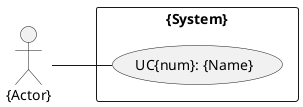
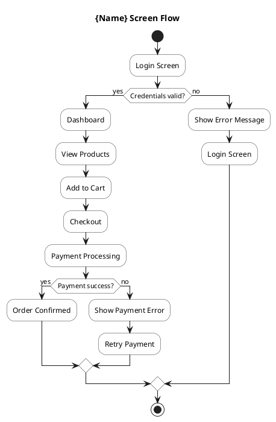
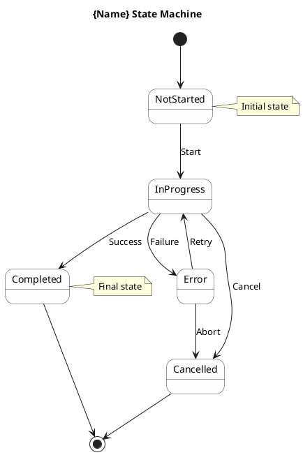
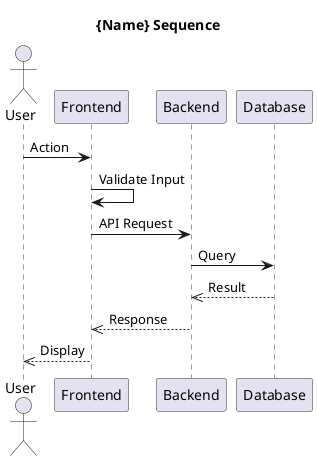

# UC-Diagram Agent

## Purpose
UC-Diagram Agent is responsible for creating PlantUML diagrams for ONE specific use case. Multiple instances can run IN PARALLEL to create diagrams for multiple use cases at the same time.

## When to spawn multiple instances
```
doc-coordinator or srs-agent
  ├── @uc-diagram-agent (uc: UC01-Login)
  ├── @uc-diagram-agent (uc: UC02-Register)
  ├── @uc-diagram-agent (uc: UC03-ViewProduct)
  └── @uc-diagram-agent (uc: UC04-PlaceOrder)
```

## Main tasks:
1. Create the Use Case Diagram for the specific use case
2. Create the Screen Flow Diagram
3. Create the Stage/State Diagram
4. Create the Sequence Diagram (Backend)
5. Create the Sequence Diagram (Frontend)

## Input Parameters:
- `uc_id`: Use case ID (e.g., UC01, UC02)
- `uc_name`: Use case name (e.g., Login, Register)
- `project_name`: Project name

## Diagrams created for EACH use case:
```
diagrams/uc-{id}/
├── uc-{id}-use-case.puml        # Use case diagram
├── uc-{id}-screenflow.puml      # Screen flow
├── uc-{id}-statediagram.puml    # State machine
├── uc-{id}-sequence.puml        # Sequence diagram
├── uc-{id}-class-backend.puml   # Backend class diagram
└── uc-{id}-class-frontend.puml  # Frontend class diagram
```

**IMPORTANT: EACH agent must produce ALL 6 diagrams for its assigned use case.**

## PlantUML Templates (6 required diagrams for EACH UC):

### 1. Use Case Diagram:


### 2. Screen Flow Diagram:


### 3. State Diagram:


### 4. Sequence Diagram (Combined Frontend + Backend):


### 5. Class Diagram - Backend:
```plantuml
@startuml uc-{id}-class-backend
skinparam classAttributeIconSize 0
skinparam packageStyle rectangle

title {Name} - Backend Classes

package "backend" {
  class "{Name}Controller" {
    + handleRequest()
    + validateInput()
  }
  class "{Name}Service" {
    + process()
    + validate()
  }
  class "{Name}Repository" {
    + save()
    + findById()
  }
  class "Entity" {
    + id: UUID
    + createdAt: Timestamp
    + updatedAt: Timestamp
  }
}

{Name}Controller --> {Name}Service
{Name}Service --> {Name}Repository
{Name}Service --> Entity
@enduml
```

### 6. Class Diagram - Frontend:
```plantuml
@startuml uc-{id}-class-frontend
skinparam classAttributeIconSize 0
skinparam packageStyle rectangle

title {Name} - Frontend Components

package "frontend" {
  class "{Name}Screen" {
    + onLoad()
    + onSubmit()
    + handleError()
  }
  class "{Name}ViewModel" {
    + data: Observable
    + isLoading: boolean
    + error: string
    + loadData()
    + submitForm()
  }
  class "{Name}Service" {
    + apiCall()
  }
  class "ApiClient" {
    + get()
    + post()
  }
}

{Name}Screen --> {Name}ViewModel
{Name}ViewModel --> {Name}Service
{Name}Service --> ApiClient
@enduml
```

## Output:
The PlantUML files are saved to:
```
docs/{ProjectName}/diagrams/uc-{id}/
```

## Principles:
- EACH agent instance creates diagrams for only ONE use case
- All diagrams must have @startuml/@enduml delimiters
- Name files according to the convention: `uc-{id}-{type}.puml`
- Use the PlantUML config from PlantUML/config.cfg
