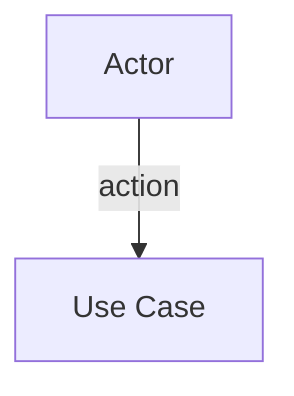
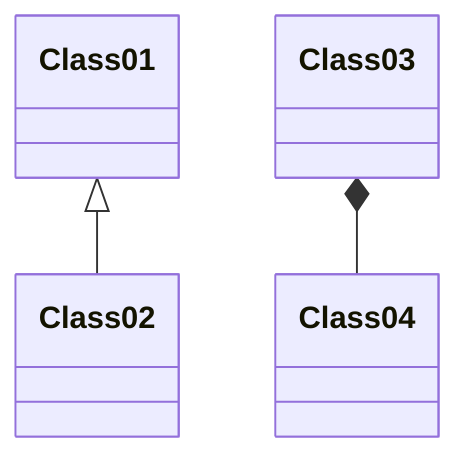
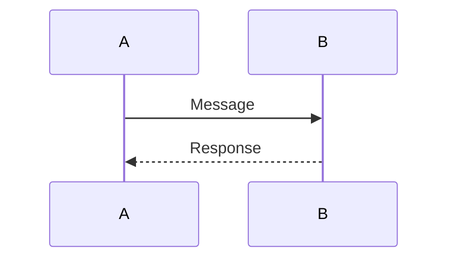
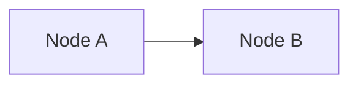
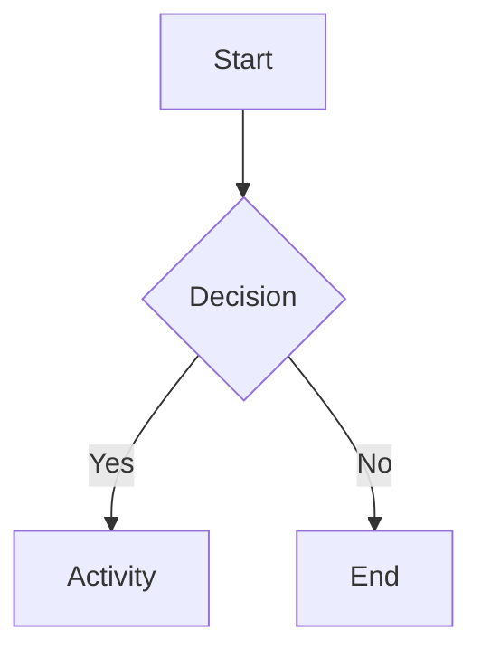
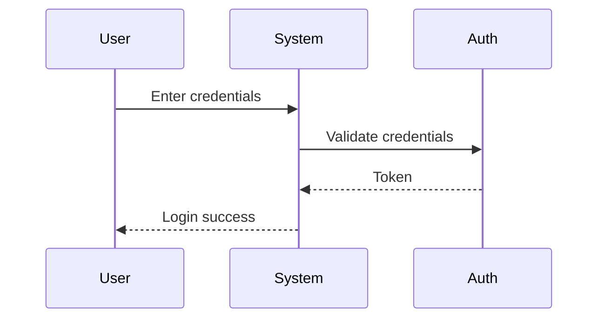

# Tool: create-diagram

## Mô tả
Tạo UML diagram sử dụng Mermaid syntax từ mô tả text.

## Các loại Diagram

### 1. Use Case Diagram


### 2. Class Diagram


### 3. Sequence Diagram


### 4. Component Diagram
```mermaid
componentDiagram
    ComponentA --> ComponentB
```

### 5. Deployment Diagram


### 6. Activity Diagram


## Parameters

| Parameter | Type | Required | Description |
|-----------|------|----------|-------------|
| type | string | Yes | Loại diagram |
| name | string | Yes | Tên diagram |
| description | string | Yes | Mô tả chi tiết |
| output | string | No | Đường dẫn output |

## Output

Mermaid code và preview (nếu hỗ trợ)

## Usage Example

```
User: /create-diagram sequence --name UserLogin --description "User enters credentials, system validates, returns token"

Agent: Creating sequence diagram...
Agent: Generated Mermaid code:

```
